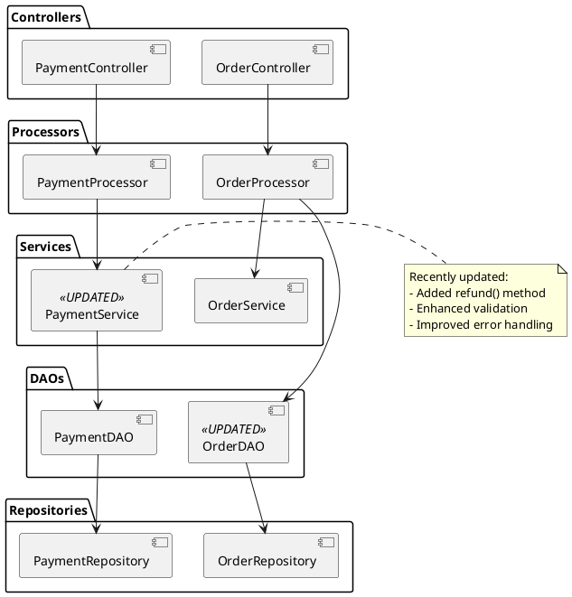

# sync-docs: Implementation Guide

---

## Part 1: Invocation & Git History Analysis

### User Invokes Skill

```
User: "Sync documentation based on code changes"

Skill:
1. Determines last documentation sync timestamp (from .sync-docs-metadata.json)
2. Runs: git log --since="LAST_SYNC_TIME" --format="%H|%an|%ae|%ad|%s|%b"
3. Parses conventional commit messages (feat:, fix:, docs:, chore:, etc.)
4. Extracts Jira ticket references (CARD-101-A-1, etc.)
5. Analyzes which files changed in each commit
```

### Git Log Analysis

```
Example git history:
  - feat(PaymentService): Add refund functionality (CARD-101-A-5)
  - feat(OrderController): Add new /orders endpoint (CARD-101-A-6)
  - chore(pom.xml): Upgrade Spring Boot to 3.2.5 (CARD-101-A-7)
  - fix(OrderDAO): SQL injection vulnerability fix
  - docs(README): manual update (ignored, marked with docs:)

Skill parses:
  Type: feat, fix, chore, docs
  Scope: PaymentService, OrderController, pom.xml, README, OrderDAO
  Description: What changed
  Body: Additional details, Jira tickets
```

---

## Part 2: Change Detection & Impact Analysis

### Scan Changed Files

```java
// Skill analyzes git diff
git diff HEAD~N HEAD --name-only

Files changed:
  src/main/java/com/bank/acquisitions/service/PaymentService.java
  src/main/java/com/bank/acquisitions/controller/OrderController.java
  src/main/java/com/bank/acquisitions/dao/OrderDAO.java
  src/main/resources/pom.xml
  src/main/resources/application.yml
  src/test/java/...
```

### Map Changes to Documentation

```
Java file changes:
  PaymentService changed → Update ARCHITECTURE.md (Service layer)
  OrderController changed → Update API.md (new endpoints)
  OrderDAO changed → Update ARCHITECTURE.md (DAO layer)

Config changes:
  pom.xml changed → Update README.md (requirements section)
  application.yml changed → Update DEPLOYMENT.md, README.md (running section)

Result:
  Docs to update: README, CHANGELOG, API.md, ARCHITECTURE.md, DEPLOYMENT.md
```

---

## Part 3: README.md Validation & Generation

### Check 7 Mandatory Sections

```java
String[] mandatory_sections = {
  "description",
  "requirements", 
  "installation",
  "running",
  "development standards",
  "contributing",
  "license"
};

// Validate each section exists and is non-empty
for (String section : mandatory_sections) {
    boolean exists = readme.contains("## " + section);
    boolean hasContent = readme.contains(section) && 
                        getContentBetween(readme, section, nextSection).length > 50;
    
    if (!exists || !hasContent) {
        // Auto-generate from template
        generateSection(section, template);
    }
}
```

### Auto-Generate Missing Sections

```markdown
## description
<!-- AUTO-GENERATED START: description -->
${PROJECT_DESCRIPTION_FROM_GIT_REPO}

This is a Spring Boot Reactive application that manages payments and orders.
<!-- AUTO-GENERATED END: description -->

## requirements
<!-- AUTO-GENERATED START: requirements -->
- Java 11 or higher
- Spring Boot 3.2.5
- Maven 3.8+
- PostgreSQL 13+ (for database)
- Docker (for containerization)
<!-- AUTO-GENERATED END: requirements -->

## installation
<!-- AUTO-GENERATED START: installation -->
1. Clone the repository: git clone https://gitlab.com/bank/acquisitions.git
2. Build: mvn clean install
3. Database setup: See DEPLOYMENT.md for database configuration
<!-- AUTO-GENERATED END: installation -->

## running
<!-- AUTO-GENERATED START: running -->
Run locally:
  mvn spring-boot:run

With specific profile:
  mvn spring-boot:run -Dspring-boot.run.arguments="--spring.profiles.active=dev"

Access: http://localhost:8080
<!-- AUTO-GENERATED END: running -->

## development standards
<!-- AUTO-GENERATED START: development standards -->
See LANGUAGE-SPRING-REACTIVE.md for:
- Layer architecture (Controllers, Processors, Services, DAOs)
- Reactive patterns (Mono<T>, Flux<T>, no .block())
- Testing standards (JUnit 5, StepVerifier, Mockito)
- Security standards (no hardcoded secrets, SQL parameterization)
<!-- AUTO-GENERATED END: development standards -->

## contributing
<!-- AUTO-GENERATED START: contributing -->
See CONTRIBUTING.md for guidelines on:
- Forking and branching
- Commit message conventions
- Pull request process
- Code review expectations
<!-- AUTO-GENERATED END: contributing -->

## license
<!-- AUTO-GENERATED START: license -->
This project is licensed under the Apache License 2.0. See LICENSE file for details.
<!-- AUTO-GENERATED END: license -->
```

---

## Part 4: CHANGELOG.md Generation

### Parse Conventional Commits

```
Commits since last sync:
  feat(PaymentService): Add refund functionality
    → Type: Added, Scope: PaymentService, Jira: CARD-101-A-5
  
  fix(OrderDAO): SQL injection vulnerability fix
    → Type: Fixed, Scope: OrderDAO, Jira: CARD-101-A-8
  
  chore(pom.xml): Upgrade Spring Boot to 3.2.5
    → Type: Changed, Scope: Dependencies, Jira: CARD-101-A-7
```

### Generate CHANGELOG Entry

```markdown
# Changelog

All notable changes to this project are documented in this file.

The format is based on [Keep a Changelog](https://keepachangelog.com/en/1.0.0/),
and this project adheres to [Semantic Versioning](https://semver.org/spec/v2.0.0.html).

## [Unreleased]

### Added
- Refund functionality in PaymentService (CARD-101-A-5)
- New GET /orders endpoint for retrieving orders (CARD-101-A-6)
- Support for multiple payment methods

### Changed
- Spring Boot upgraded from 3.2.3 to 3.2.5 (CARD-101-A-7)
- Improved error handling in OrderProcessor

### Fixed
- SQL injection vulnerability in OrderDAO.findByUsername (CARD-101-A-8)
- Race condition in payment authorization flow
- Missing validation in OrderRequest parameters

### Security
- Implemented input validation for all API endpoints
- Updated dependency versions to patch known CVEs
```

---

## Part 5: API.md Generation

### Scan Controller Annotations

```java
// Skill analyzes Java code
@RestController
@RequestMapping("/api/orders")
public class OrderController {
    
    @GetMapping
    public Mono<List<Order>> getOrders(@RequestParam(required = false) String customerId) {
        // Skill extracts: GET /api/orders
        // Parameters: customerId (optional)
        // Return: List<Order>
        // Auth: @Secured or @PreAuthorize on class/method
    }
    
    @PostMapping("/refund")
    public Mono<RefundResult> refund(@RequestBody RefundRequest request) {
        // Skill extracts: POST /api/orders/refund
        // Request body: RefundRequest (orderId, amount)
        // Response: RefundResult (id, status, amount)
    }
}
```

### Generate API.md

```markdown
# API Documentation

## Orders API

### GET /api/orders

Retrieve orders for a customer.

**Authentication**: Required (@Secured)

**Parameters**:
- `customerId` (optional, string): Filter by customer ID

**Response**: 
```json
{
  "orders": [
    {
      "id": "order-123",
      "customerId": "cust-456",
      "total": 99.99,
      "status": "COMPLETED"
    }
  ]
}
```

**Status Codes**:
- 200: Success
- 401: Unauthorized
- 500: Server error

---

### POST /api/orders/refund

Process a refund for an order.

**Authentication**: Required (@Secured("ROLE_ADMIN"))

**Request Body**:
```json
{
  "orderId": "order-123",
  "amount": 50.00
}
```

**Response**:
```json
{
  "id": "refund-789",
  "orderId": "order-123",
  "status": "APPROVED",
  "amount": 50.00,
  "processedAt": "2026-05-13T14:30:00Z"
}
```

**Status Codes**:
- 200: Refund approved
- 400: Invalid request
- 401: Unauthorized
- 404: Order not found
- 500: Server error
```

---

## Part 6: ARCHITECTURE.md Generation

### Detect Layer Changes

```
Skill analyzes changed files:
  src/main/java/com/bank/acquisitions/service/PaymentService.java
    → Service layer changed
  src/main/java/com/bank/acquisitions/controller/OrderController.java
    → Controller layer changed
  src/main/java/com/bank/acquisitions/dao/OrderDAO.java
    → DAO layer changed

Result: Update ARCHITECTURE.md with PlantUML diagram
```

### Generate PlantUML Diagram

```markdown
# Architecture

## Layer Structure

[AutoGenerated PlantUML diagram]


```

---

## Part 7: DEPLOYMENT.md Generation

### Detect Config Changes

```
Skill analyzes changes in:
  pom.xml → Dependency versions changed
  application.yml → Configuration settings changed
  
Changes detected:
  Spring Boot: 3.2.3 → 3.2.5
  Spring Data R2DBC: 3.0.0 → 3.1.0
  Jackson: 2.14.2 → 2.15.2
```

### Generate DEPLOYMENT.md

```markdown
# Deployment Guide

## Requirements

- Java 11+
- Spring Boot 3.2.5 (UPDATED)
- PostgreSQL 13+
- Docker

## Environment Variables

```bash
# Application Settings
PORT=8080
SPRING_PROFILES_ACTIVE=prod

# Database
DATABASE_HOST=localhost
DATABASE_PORT=5432
DATABASE_NAME=acquisitions
DATABASE_USER=admin
DATABASE_PASSWORD=${DB_PASSWORD}

# Security
JWT_SECRET=${JWT_SECRET_KEY}
JWT_EXPIRATION=3600000

# AWS
AWS_ACCESS_KEY=${AWS_ACCESS_KEY}
AWS_SECRET_KEY=${AWS_SECRET_KEY}
AWS_REGION=us-east-1
```

## Configuration (application.yml)

```yaml
spring:
  boot:
    version: 3.2.5  # UPDATED from 3.2.3
  application:
    name: acquisitions-platform
  webflux:
    base-path: /api
  r2dbc:
    url: r2dbc:postgresql://${DATABASE_HOST}:${DATABASE_PORT}/${DATABASE_NAME}
    username: ${DATABASE_USER}
    password: ${DATABASE_PASSWORD}
    
server:
  port: ${PORT:8080}
  servlet:
    context-path: /
```

## Deployment Steps

1. Build: `mvn clean package`
2. Run: `java -jar target/acquisitions-*.jar`
3. Or Docker: `docker build -t acquisitions:latest . && docker run -p 8080:8080 acquisitions:latest`
```

---

## Part 8: ONBOARDING.md Generation

### Detect Structure Changes

```
Skill analyzes:
  New packages added → Explain in onboarding
  New dependencies added → Add to setup
  New tools required → Document setup
  
Changes detected:
  New package: com.bank.acquisitions.payment (PaymentService, PaymentDAO)
  New dependency: spring-boot-starter-data-r2dbc
```

### Generate ONBOARDING.md

```markdown
# Onboarding Guide

## Local Setup

### Prerequisites
- Java 11+ (JDK)
- Maven 3.8+
- PostgreSQL 13+
- Git
- IDE (IntelliJ IDEA or VS Code)

### Step 1: Clone Repository
```bash
git clone https://gitlab.com/bank/acquisitions.git
cd acquisitions-platform
```

### Step 2: Setup Database
```bash
# Create database
createdb acquisitions

# Run migrations
mvn flyway:migrate
```

### Step 3: Build Project
```bash
mvn clean install
```

### Step 4: Run Application
```bash
mvn spring-boot:run
```

Access: http://localhost:8080

## Project Structure

```
src/main/java/com/bank/acquisitions/
├── controller/       # REST endpoints
├── processor/        # Business orchestration
├── service/          # Business logic & integrations
├── dao/              # Persistence coordination
├── repository/       # Low-level R2DBC
├── model/            # Domain objects
└── config/           # Spring configuration
```

## Development Standards

See LANGUAGE-SPRING-REACTIVE.md for:
- Layer architecture
- Reactive patterns (no .block())
- TDD requirements
- Security standards

## Testing

```bash
# Run all tests
mvn test

# Run specific test
mvn test -Dtest=OrderProcessorTest

# With coverage
mvn test jacoco:report
```

## Common Tasks

### Adding a New Endpoint
1. Create controller method in `OrderController`
2. Create processor method
3. Create service method (if needed)
4. Create DAO method (if needed)
5. Write tests (TDD)
6. Update API.md

### Adding a New Service
1. Create service class in `service/`
2. Inject dependencies
3. Return Mono<T> / Flux<T>
4. Write tests
5. Update ARCHITECTURE.md
```

---

## Part 9: Content Preservation with Markers

### Protect User Content

```markdown
## Running

<!-- AUTO-GENERATED START: running -->
Run locally:
  mvn spring-boot:run
<!-- AUTO-GENERATED END: running -->

Additional notes (USER CAN EDIT HERE):
- Windows users: May need to set JAVA_HOME
- For debugging: mvn spring-boot:run -Dspring-boot.run.jvmArguments="-agentlib:jdwp=..."

## Custom Section (NOT AUTO-UPDATED)

You can add custom sections that won't be touched by sync-docs:
- Just don't use the AUTO-GENERATED markers
- They'll be preserved as-is
```

Skill only updates between markers. User content outside markers is safe.

---

## Part 10: Validation Before Output

```java
// Validate all 7 README sections
String[] mandatory = {"description", "requirements", "installation", 
                      "running", "development standards", "contributing", "license"};

for (String section : mandatory) {
    if (!readme.contains("## " + section)) {
        errors.add("Missing section: " + section);
    }
    if (getContent(section).trim().isEmpty()) {
        errors.add("Empty section: " + section);
    }
}

if (!errors.isEmpty()) {
    log.error("README validation failed: " + errors);
    return;  // Don't proceed if README invalid
}

// Check markdown syntax
validateMarkdownSyntax(readme, changelog, api_docs, architecture, deployment, onboarding);

// Check broken links
validateLinks(readme, changelog, api_docs);
```

---

## Part 11: Preview & User Approval

```
📋 Preview all changes before applying:

README.md:
  + description: 3 lines added
  + requirements: 5 lines added
  ~ running: 2 lines changed
  Total: 10 lines changed

CHANGELOG.md:
  + Added section: 5 entries
  + Fixed section: 3 entries
  Total: 8 lines added

API.md:
  + POST /orders/refund: 25 lines added
  Total: 25 lines added

ARCHITECTURE.md:
  ~ PlantUML diagram updated
  Total: 15 lines changed

[Show diffs for each file]

User reviews and approves.
```

---

## Part 12: Git Commit & Push

```bash
# Create feature branch
git checkout -b sync-docs/2026-05-13

# Commit changes
git add README.md CHANGELOG.md API.md ARCHITECTURE.md DEPLOYMENT.md ONBOARDING.md

git commit -m "docs: auto-sync documentation based on code changes

- Updated README.md (requirements, running sections)
- Updated CHANGELOG.md (new features, fixes)
- Updated API.md (new /refund endpoint)
- Updated ARCHITECTURE.md (PaymentService changes)
- Updated DEPLOYMENT.md (Spring Boot 3.2.5)
- Updated ONBOARDING.md (new package structure)

Synced from commits: CARD-101-A-5, CARD-101-A-6, CARD-101-A-7, CARD-101-A-8

Closes: CARD-101-A-5, CARD-101-A-6, CARD-101-A-7, CARD-101-A-8"

# Push to GitLab
git push origin sync-docs/2026-05-13

# Create MR
gitlab create-merge-request \
  --title "docs: auto-sync documentation" \
  --target main \
  --source sync-docs/2026-05-13 \
  --description "[MR description with changes summary]"
```

---

## Part 13: Update Metadata

```json
// .sync-docs-metadata.json
{
  "lastSyncTime": "2026-05-13T14:30:00Z",
  "lastSyncCommit": "abc123def456",
  "docsUpdated": [
    "README.md",
    "CHANGELOG.md",
    "API.md",
    "ARCHITECTURE.md",
    "DEPLOYMENT.md",
    "ONBOARDING.md"
  ],
  "jiraTicketsProcessed": [
    "CARD-101-A-5",
    "CARD-101-A-6",
    "CARD-101-A-7",
    "CARD-101-A-8"
  ],
  "changesSummary": {
    "linesAdded": 87,
    "linesRemoved": 12,
    "filesChanged": 6
  }
}
```

---

## Summary

The `sync-docs` skill:
1. ✅ Analyzes git history (conventional commits)
2. ✅ Detects code changes and impact
3. ✅ Validates README (7 mandatory sections)
4. ✅ Generates documentation updates
5. ✅ Preserves user content (markers)
6. ✅ Previews changes (user approval)
7. ✅ Commits and pushes (git workflow)
8. ✅ Updates metadata (tracking)
9. ✅ Integrates with Jira and GitLab

All documentation stays in sync with code automatically.
